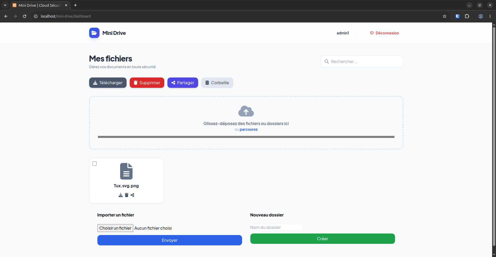
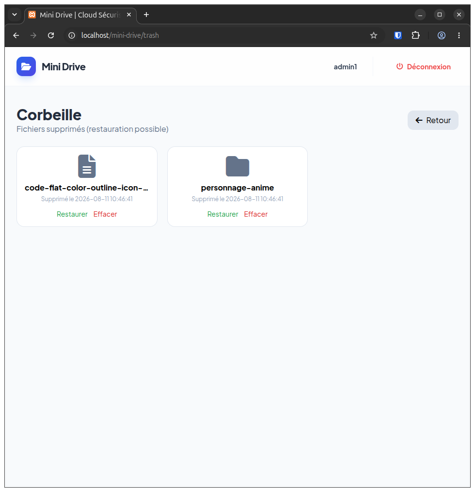

# Mini Drive

> Lightweight self-hosted file storage built with PHP, MySQL and a custom MVC architecture.


Mini Drive is a lightweight, self-hosted web application for storing and managing personal files and directories.

The project is intentionally built with native PHP, without a third-party framework, to provide a practical implementation of MVC architecture, custom routing, database abstraction with PDO, file handling, and Linux filesystem permissions.

The application is designed to be deployed on a Linux server, making it both a web development project and a practical system administration exercise.

---

## 📁 Project Structure

```text
mini-drive/
├── app/
│   ├── Controllers/   # Application request handlers
│   ├── Core/          # MVC core components, routing and database layer
│   ├── Models/        # Database and application models
│   └── Views/         # Application views and layouts
├── config/            # Application configuration and database schema
├── public/            # Web assets and file storage
├── index.php          # Application entry point
└── README.md
```
---

## ✨ Features

- **User Authentication** — User registration and login.
- **File Upload** — Upload and store files through the web interface.
- **File Management** — Organize, access and manage stored files.
- **File Sharing** — Share stored files through the application.
- **Trash Management** — Soft-delete files and manage deleted items.
- **Custom MVC Architecture** — Controllers, models, views and a custom routing layer built from scratch.
- **Database Access** — MySQL/MariaDB integration through PDO.
- **Linux File Permissions** — Storage permissions managed at the filesystem level.
- **Responsive Interface** — Web interface designed for desktop and mobile usage.

---

## 🏗️ Architecture

Mini Drive follows a lightweight MVC architecture implemented from scratch in native PHP.

The application uses:

- **Controllers** to handle application requests and business flow.
- **Models** to interact with the database.
- **Views** to render the user interface.
- **Router** to map HTTP requests to application controllers.
- **PDO** for database communication.

---

## 🛠️ Technical Stack

| Layer | Technology |
|---|---|
| Backend | Native PHP |
| Architecture | Custom MVC |
| Database | MySQL / MariaDB |
| Database Access | PDO |
| Frontend | HTML5, CSS3, JavaScript |
| Web Server | Apache |
| Target Environment | Ubuntu Server / Linux |

For local development, the application can be run using XAMPP or a native PHP/Apache environment.

---

## ⚙️ Installation

### 1. Clone the repository

   ```bash
   git clone https://github.com/aroutiana18/mini-drive.git
   cd mini-drive
   ```

### 2. Create the database

Import the SQL schema:

   ```bash
   mysql -u root -p < config/mini_drive.sql
   ```

Or import `config/mini_drive.sql` using phpMyAdmin.

### 3. Configure the application

Update the database configuration in: `config/config.php`

### 4. Configure file storage permissions

On Linux:

   ```bash
   sudo chown -R www-data:www-data public/uploads
   sudo chmod -R 775 public/uploads
   ```

---

## 🖥️ Deployment

Mini Drive is intended to be deployed on a Linux server.

The planned deployment environment includes:

- Ubuntu Server
- Apache
- PHP
- MySQL / MariaDB
- Linux filesystem permissions

The deployment process is part of the project itself and is intended to provide practical experience with Linux server administration, web server configuration, database services, and filesystem permissions.

---

## 📌 Project Status

**Status:** In development

Mini Drive is currently being developed as a personal learning project focused on PHP web development, Linux server administration, and self-hosted application deployment.

---

## 📸 Screenshots

### Dashboard



### Trash



## 👤 Author

**Arotiana MAHERINANDRASANA**

Computer Science student focused on **Systems & Network Administration**.

- GitHub: [@aroutiana18](https://github.com/aroutiana18)
- LinkedIn: [Arotiana](https://www.linkedin.com/in/arotiana-brad-florentin-maherinandrasana/)
